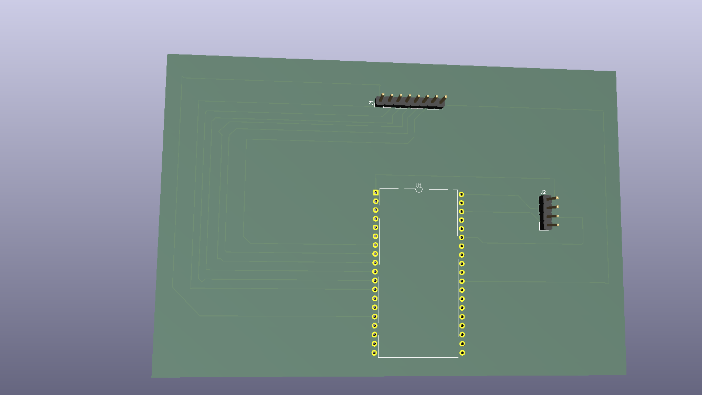

# Tic-Tac-Toe (Kółko i Krzyżyk) - ESP32 & LCD I2C

An interactive Tic-Tac-Toe game implemented on the **ESP32 microcontroller**, utilizing a **4x4 Matrix Keypad** for player input and a **20x4 LCD Display (I2C)** for the visual board representation.

## 📺 Project Demonstration
See the project in action on YouTube:
👉 [Watch the Video Demonstration](https://youtube.com/shorts/P2gXw24iPWE)

---

## 🛠️ Hardware Requirements
* **Microcontroller:** ESP32 (e.g., ESP32 NodeMCU-32S)
* **Display:** LCD 20x4 with an I2C interface adapter (PCF8574)
* **Input:** 4x4 Membrane Matrix Keypad
* **Custom Baseboard PCB** (or Connecting Wires & Breadboard)

### Pin Mapping

#### ⌨️ 4x4 Keypad Connection
| Keypad Pin | ESP32 GPIO |
|------------|------------|
| Row 1      | GPIO 13    |
| Row 2      | GPIO 14    |
| Row 3      | GPIO 27    |
| Row 4      | GPIO 26    |
| Column 1   | GPIO 25    |
| Column 2   | GPIO 33    |
| Column 3   | GPIO 32    |
| Column 4   | GPIO 17    |

#### 📺 LCD 20x4 I2C Connection
| LCD I2C Pin | ESP32 GPIO |
|-------------|------------|
| VCC         | 3.3V (VIN)   |
| GND         | GND        |
| SDA         | GPIO 21    |
| SCL         | GPIO 22    |

---

## 🗺️ Custom PCB Design

To eliminate messy breadboard wiring and create a durable, standalone gaming device, a dedicated dual-layer custom PCB baseboard was designed using **KiCad**. 

### Features:
* **Socketed MCU:** The board utilizes female pin headers, allowing the ESP32 NodeMCU to be easily plugged in or removed.
* **Clean Peripherals Connection:** Dedicated `1x08` and `1x04` pin headers are placed near the edges for straightforward ribbon cable routing from the keypad and LCD.
* **Optimized Power Delivery:** Safe 5V routing directly to the LCD backpack to ensure clear screen contrast without stressing the ESP32's internal 3.3V regulator.
* **Ground Plane:** Full top and bottom copper pour for noise reduction and stable operation.

The complete KiCad design files can be found in the [`hardware/`](./hardware) directory.

### 🖼️ 3D Render Preview:


---

## 🕹️ Game Rules & Controls
1. **Starting the Game:** The game boots up automatically with player **'X'** making the first move.
2. **Making a Move:** Use numeric keys **1 to 9** on the keypad to select a position on the 3x3 grid:
   ```text
   1 | 2 | 3
   ---------
   4 | 5 | 6
   ---------
   7 | 8 | 9
